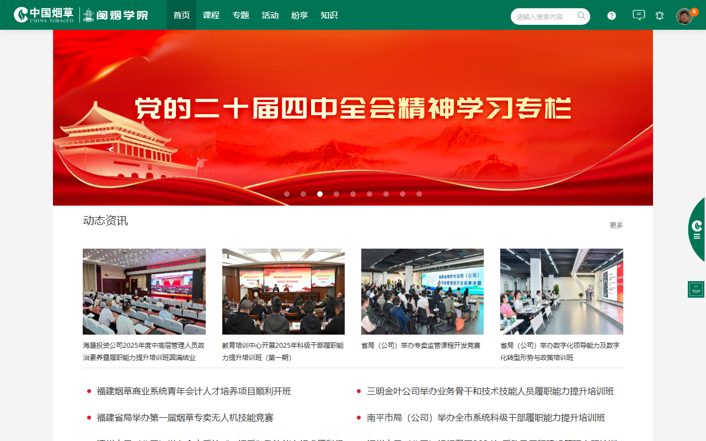
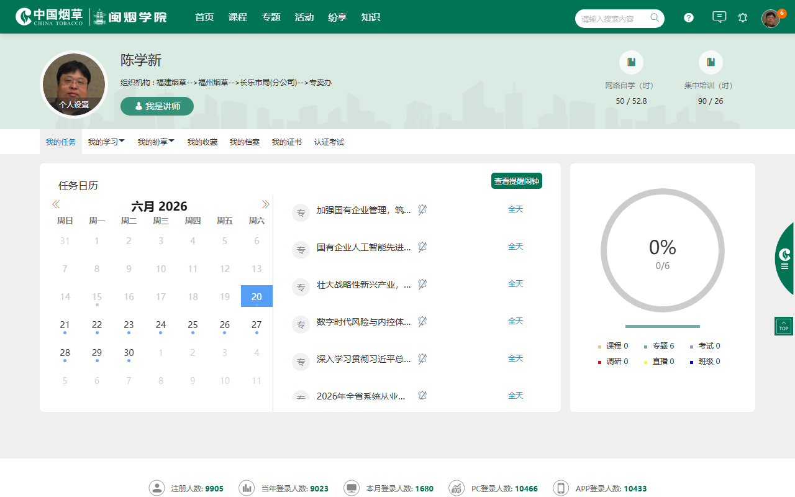

# 🎓 cttc-auto-learn

[English](./README.md) | 中文

烟草网络学院 (mooc.ctt.cn) 自动学习系统。基于 Playwright 构建。

## ✨ 功能特性

- 🔐 **微信扫码登录** — 扫码登录，会话持久化到 `auth-state.json`
- 📺 **自动播放视频** — 逐个播放未完成课程，追踪到 100% 完成
- 📊 **学时监控** — 实时拦截 credit/cadre-education API 获取学时统计
- 🎯 **目标驱动** — 可配置目标学时（默认 50 小时），达到后自动退出
- 🛡️ **防检测** — 定时鼠标移动（每 25 分钟）、单实例锁、单标签页强制
- 🔄 **崩溃恢复** — 浏览器崩溃自动重试最多 5 次，强制清理残留进程
- 📈 **实时状态** — 实时状态文件 (`output/status.json`) 供外部监控
- 🖥️ **终端仪表盘** — 带进度条的交互式监控面板
- 🎮 **四种模式** — 刷学时、刷专题、刷课程、刷任务

---

## 📸 操作截图

### 首页（已登录）



### 学习中心


### 任务页面



---

## 🚀 快速开始

### 环境要求

- Python 3.11+
- Windows 10/11

### 克隆项目

```bash
git clone https://github.com/gandli/cttc-auto-learn.git
cd cttc-auto-learn
```

### 安装依赖

**uv（推荐）：**

```bash
uv sync
```

**pip + venv（Python 原生）：**

```bash
python -m venv .venv
source .venv/bin/activate  # Linux/macOS
.venv\Scripts\activate     # Windows
pip install .
```

### 运行

**uv：**

```bash
# 刷学时（默认）
uv run python main.py

# 刷专题
uv run python main.py --mode topics

# 刷课程
uv run python main.py --mode courses

# 刷任务
uv run python main.py --mode tasks
```

**pip（已激活 venv）：**

```bash
python main.py
python main.py --mode topics
python main.py --mode courses
python main.py --mode tasks
```

**参数说明：**
- `--mode hours` - 刷学时（默认）
- `--mode topics` - 刷专题
- `--mode courses` - 刷课程
- `--mode tasks` - 刷任务
- `--target 50` - 目标学时（默认 50）
- `--headless` - 无头模式

1. 浏览器窗口会打开并显示登录页面
2. 使用微信扫描二维码
3. 登录成功后，脚本会自动开始学习

凭证保存在 `output/auth-state.json`，后续运行无需重复扫码。

### AI Agent 使用

安装 SKILL：

```bash
npx skills add gandli/cttc-auto-learn
```

安装后，只需对 Agent 说：

```
帮我刷学时
```

或

```
帮我刷专题
帮我刷课程
帮我刷任务
帮我刷班级
```

Agent 会自动执行：
1. 检查并克隆项目
2. 安装 Python 依赖
3. 打开浏览器登录（首次需扫码）
4. 自动播放视频课程
5. 监控学时进度
6. 达到目标后自动退出

---

## 🎮 四种运行模式

| 模式 | 命令 | 说明 | 触发词 |
|------|------|------|--------|
| 刷学时 | `--mode hours` | 播放视频累计学时（默认） | "帮我刷学时" |
| 刷专题 | `--mode topics` | 完成专题课程 | "帮我刷专题" |
| 刷课程 | `--mode courses` | 完成所有未完成课程 | "帮我刷课程" |
| 刷任务 | `--mode tasks` | 完成指定任务 | "帮我刷任务" |

### 刷学时模式（默认）

```bash
uv run python main.py --mode hours --target 50
```

- 播放视频累计学时
- 达到目标学时后自动退出
- 每 30 分钟通过 API 刷新学时数据

### 刷专题模式

```bash
uv run python main.py --mode topics
```

- 自动发现并完成专题课程
- 遍历专题内的所有课程

### 刷课程模式

```bash
uv run python main.py --mode courses
```

- 完成所有未完成的课程
- 跳过已完成的课程

### 刷任务模式

```bash
uv run python main.py --mode tasks
```

- 完成指定任务
- 通过 API 获取任务列表

---

## 📊 实时监控

### 查看状态文件

```bash
cat output/status.json | python -m json.tool
```

### 终端监控面板

```bash
uv run python scripts/monitor.py
```

### 状态字段说明

| 字段 | 说明 |
|------|------|
| `status` | 当前状态：playing/paused/completed |
| `video_progress` | 当前视频播放进度 (%) |
| `study_hours_current` | 当前学时 |
| `study_hours_target` | 目标学时 |
| `courses_completed` | 已完成课程数 |
| `courses_pending` | 待学习课程数 |

---

## 📁 项目结构

```
cttc-auto-learn/
├── main.py                # 主入口
├── cttc/                  # 核心模块
│   ├── login.py           # 登录（二维码、凭证）
│   ├── player.py          # 视频播放
│   ├── course.py          # 课程管理
│   ├── data_manager.py    # API 数据获取
│   ├── monitor.py         # 学时监控
│   ├── progress.py        # 进度追踪
│   ├── config.py          # 配置管理
│   ├── logger.py          # 日志系统
│   ├── qr.py              # 二维码生成
│   ├── selectors.py       # CSS 选择器
│   ├── status.py          # 状态报告
│   └── process_manager.py # 进程管理
├── scripts/               # 工具脚本
│   ├── explore/           # API 探索脚本
│   │   ├── api_explore.py
│   │   ├── crawl_site.py
│   │   └── ...
│   ├── cdp_login_analyzer.py
│   └── monitor.py         # 终端监控面板
├── tests/                 # 测试文件 (168 tests)
├── docs/                  # 文档
│   ├── analysis/          # 技术分析报告
│   └── crawl/             # API 爬取结果
├── SKILLS/                # AI Agent 工作流
│   └── cttc-auto-learn/
│       └── SKILL.md       # Agent 安装后自动执行
├── data/                  # 运行时数据 (gitignored)
├── output/                # 输出目录 (gitignored)
│   ├── auth-state.json    # 登录凭证
│   ├── status.json        # 实时状态
│   └── crawl/             # 爬取原始数据
├── pyproject.toml         # 项目配置
├── CHANGELOG.md           # 版本历史
└── README.md
```

---

## 🗺️ 开发路线图

### ✅ 已完成 (v0.0.1)

| 模块 | 说明 |
|------|------|
| QR 扫码登录 | APP + 微信双通道二维码登录 |
| v22 快速登录 | Headless Chrome + HTTP 并行轮询 |
| 四种运行模式 | 刷学时 / 刷专题 / 刷课程 / 刷任务 |
| 视频自动播放 | 自动播放并追踪进度到 100% |
| 学时统计 | 基于 API 的学时监控，达标自动退出 |
| DataManager | REST API 数据获取 |
| StudyPlanner | 智能学习规划生成 |
| 测试 | 168 项测试通过（登录、播放、进度、监控、调度） |

### 🔜 计划开发

**v0.1.0 — 易用性 + 刷班级**
- 凭证加密存储（`auth-state.json` → `auth-state.enc`）
- 会话自动续期（过期前自动刷新）
- `config.yaml` 预设配置（目标学时、模式、无头模式等）
- `python -m cttc` 入口点
- **新增「刷班级」模式** — 自动完成班级培训课程（`--mode classes`）
  - 获取我的班级列表（`/api/v1/human/class/findMyClassPage`）
  - 遍历班级课程，逐个播放
  - 统计集中培训学时（`classroom_completed / classroom_target`）
  - 支持油猴脚本和 CDP 版本同步实现

**v0.2.0 — 监控**
- Web 仪表盘实时查看进度
- 任务完成时邮件 / 微信通知
- 学习历史与统计导出（CSV / JSON）

**v0.3.0 — 智能化**
- 智能课程调度（优先级、难度、截止日期）
- 自动备考（题库练习）
- 多账户支持

**v1.0.0 — 生产化**
- Docker 容器化部署
- GitHub Actions CI/CD
- 跨平台支持（Linux / macOS）
- PyPI 发布（`pip install cttc-auto-learn`）

---

## 📄 许可证

MIT
